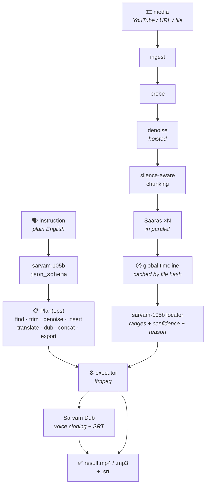

<<<<<<< Updated upstream
<div align="center">
=======
# 🎬 thinklater — Natural-Language Video Editor Agent
>>>>>>> Stashed changes

# 🎬 ClipIt

### Edit audio and video by describing the scene. Never touch a timestamp.

**"Trim the part where he talks about India and dub it in Hindi."**

That sentence is the entire interface. ClipIt finds the moment, cuts it, cleans it,
dubs it into an Indian language — and tells you *why* it picked that segment.

[](https://www.python.org/)
[](https://react.dev/)
[](https://fastapi.tiangolo.com/)
[](https://www.sarvam.ai/)
[](LICENSE)
[](#-contributing)

[Quick start](#-quick-start) · [How it works](#-how-it-works) · [API](#-http-api) · [Contributing](#-contributing) · [Field notes](#-field-notes-things-the-docs-dont-tell-you)

</div>

---

## Why this exists

Every editing tool, from Premiere to the simplest online trimmer, asks a creator the
same question: **where?** Answering it means scrubbing a timeline, hunting for a moment
you already remember perfectly well, and converting it into two numbers.

The creative intent — *"the bit where she reads out her card number"* — was clear from
the start. The timestamps were never the point. They were just the price of admission.

ClipIt removes them. You describe the scene; the agent reads a timestamped transcript,
reasons about it, plans a chain of operations, and executes it. Nothing is
keyword-matched: ask for *"the part where she introduces herself"* and it works, because
no rule was ever written for *introduces herself*.

```
"Remove the noise from the part where he says 'I am a moster'"
                                                    ↑
                        deliberately misspelled — still lands on "monster",
                        because matching is semantic, not string equality
```

---

## ✨ What it does

| You say | The agent plans |
|---|---|
| "Trim the part where it tells the credit card number" | find → trim |
| "Dub the audio in Hindi" | dub (transcription skipped entirely) |
| "Trim the credit card part and dub it in Hindi" | find → trim → dub |
| "Remove background noise from this audio" | denoise |
| "Remove the noise from the part where he says 'I am a moster'" | denoise → find → trim |
| "After he says Amazon, insert the word 'Sarvam'" | insert |
| "Insert 'Sarvam' after Amazon, then trim the company list" | insert → find → trim |

Ops compose freely. The agent decides the chain — you never pick from a menu.

**`insert`** is the one op that *adds* rather than removes: it speaks new words with
Bulbul TTS and splices them in beside an anchor phrase you name. On video, a window of
picture is gently slowed across the insertion point (rather than freezing a frame, which
reads as a glitch) so everything after it stays in sync.

`insert` is the one op that *adds* rather than removes: it speaks the new words
with Bulbul and splices them in next to an anchor you name. On video the frame
at the insertion point is held for exactly the length of the new audio, so
everything after it stays in sync with the picture.

**Input:** YouTube link · direct audio/video URL · uploaded file
**Output:** trimmed / denoised / dubbed / augmented MP4 or MP3, plus an SRT when dubbing.

---

## 🚀 Quick start

### Prerequisites

- **Python 3.12+**
- **ffmpeg + ffprobe** on your `PATH` — every trim, denoise, concat and mux shells out to them
- **Node 22+** (only if you want the web editor)
- A **Sarvam AI API key** — [get one here](https://dashboard.sarvam.ai/) (free credit is plenty to try it)

```bash
sudo apt install -y ffmpeg          # macOS: brew install ffmpeg
                                    # no root? pip install static-ffmpeg — it's auto-detected
```

### Install

```bash
git clone https://github.com/me-shivamo/thinklater.git
cd thinklater

python -m venv .venv && source .venv/bin/activate   # or: uv venv && source .venv/bin/activate
pip install -r requirements.txt                     # or: uv pip install -r requirements.txt

cp .env.example .env                                # add SARVAM_API_KEY (+ TELEGRAM_BOT_TOKEN)
```

### Run it

<details open>
<summary><b>⌨️ CLI</b> — the shortest path to seeing it work</summary>

```bash
# Check a source without spending anything
python cli.py -i "https://media.w3.org/2010/05/sintel/trailer.mp4" --probe

# A real edit
python cli.py \
  -i "https://media.w3.org/2010/05/sintel/trailer.mp4" \
  -q "trim the part where he asks what brings you to the land of the gatekeepers" \
  -o out/result.mp4

# Fast dub path (local TTS, ~10x faster than server-side voice cloning)
python cli.py --dub-engine manual -i sample.mp3 -q "dub this in Tamil"

# Show the plan and every API call
python cli.py -v -i "<url>" -q "..."
```

</details>

<details>
<summary><b>🌐 Web editor</b> — two processes</summary>

```bash
# Terminal 1 — the engine
uvicorn server:app --reload --port 8000

# Terminal 2 — the UI
cd web
cp .env.example .env        # VITE_USE_FIXTURES=0 talks to the live engine
npm install
npm run dev                 # http://localhost:5173
```

The Vite dev server proxies `/api` to `VITE_BACKEND_ORIGIN`, so the browser only ever
talks to one origin — which is what makes SSE and HTTP Range work without CORS config.

> 💡 Set `VITE_USE_FIXTURES=1` to run the **entire UI offline** against
> `src/fixtures/*.json` — no backend, no API spend. Ideal for front-end work.
> A "Demo mode" badge appears in the header whenever it's on.

</details>

<details>
<summary><b>💬 Telegram bot</b></summary>

```bash
python bot.py
```

Wait for `ClipIt bot is up.`, then send it a link and an instruction **in one message**:

```
https://media.w3.org/2010/05/sintel/trailer.mp4 remove background noise from this video
```

Keep it alive after closing the terminal:

```bash
setsid nohup .venv/bin/python bot.py > work/bot.log 2>&1 < /dev/null &
tail -f work/bot.log
```

</details>

<details>
<summary><b>🐳 Docker</b> — all three surfaces in one container</summary>

```bash
docker build -t clipit .
docker run -p 8000:8000 \
  -e SARVAM_API_KEY=sk_xxx \
  -e TELEGRAM_BOT_TOKEN=123456:ABC \
  clipit
```

Stage 1 builds the Vite bundle with Node 22; stage 2 is Python 3.12 + ffmpeg and copies
`dist/` in. `server.py` mounts it at `/` beneath every `/api` route. See
[DEPLOY.md](DEPLOY.md) for one-click Render deployment.

</details>

---

## 🧠 How it works



### The scheduling is where the agent earns its keep

1. **`denoise` is hoisted before transcription** when the plan also needs `find` — cleaner
   audio transcribes better, and one filter pass serves both the transcript and the output.
2. **Transcription is skipped entirely** for whole-file dubs; Sarvam Dub transcribes internally.
3. **`trim` always runs before `dub`** — dub cost and latency scale with output length.
4. **`insert` is hoisted ahead of everything**, so it runs against the media the transcript
   actually describes. Later ops are re-timed through `_shift_for_inserts`, and any segment
   the insertion lands inside is split at that point — so a following dub doesn't talk over
   the new words.
5. **Cuts snap to segment boundaries**, so a clip never opens mid-word.

### Built entirely on Sarvam

| API | Role |
|---|---|
| **Saaras** | Speech-to-text with timestamps, built for Indic and code-mixed audio |
| **sarvam-105b** | Instruction → op plan, and transcript → segment location |
| **Sarvam Translate** | Text translation on the fast local dub path |
| **Bulbul** | Text-to-speech for `insert` and the local dub path |
| **Sarvam Dub** | Server-side dubbing with speaker voice cloning + SRT export |

ffmpeg does the cutting. Nothing else calls out.

Language coverage differs across all four APIs — so every supported set is mapped
explicitly in `clipit/config.py`, and unsupported requests fail with **the list of
languages that would have worked**, rather than silently.

### Measured

| Instruction | Wall time |
|---|---|
| Trim (first run, includes transcription) | ~14s |
| Denoise + trim | ~20s |
| Trim + dub (local TTS path) | ~46s |
| Trim + dub (Sarvam Dub, voice-cloned) | ~5 min |

On a trim, the two LLM calls are ~14s of the total and ffmpeg is 0.2s. On a dub, the
Sarvam Dub job is ~93% of wall time.

---

## 🔌 HTTP API

`server.py` is the only backend surface the web editor talks to. The contract is frozen:

```http
POST /api/ingest             {url} | multipart file   -> {job_id, media_id}
GET  /api/media/{media_id}   bytes (HTTP Range / 206) -> <video> source
GET  /api/transcript/{id}    -> {language, duration, segments:[...]}
POST /api/instruct           {media_id, instruction}  -> {job_id}
GET  /api/events/{job_id}    -> SSE stream of ProgressEvent
GET  /api/result/{job_id}    -> {clips, output_url, srt_url, plan}
GET  /api/download/{job_id}  -> final file (HTTP Range / 206)
GET  /api/jobs/{job_id}      -> polling fallback {status, event}
GET  /api/health             -> {"ok": true, ...}
```

**Shapes**

```ts
Segment       { id, start, end, text }
ProgressEvent { stage, status, message, pct }
Clip          { start, end, reason, confidence, segment_ids }
Plan          { reasoning, ops[], unsupported_language }
```

The pipeline is a blocking generator, so `/api/instruct` runs it on a worker thread and
buffers its events for both the SSE and polling endpoints.

---

## ⚙️ Configuration

1. **`denoise` is hoisted before transcription** when the plan also needs `find` —
   cleaner audio transcribes better, and one filter pass serves both.
2. **Transcription is skipped entirely** for whole-file dubs; Sarvam Dub
   transcribes internally.
3. **Trim always happens before dub** — dub cost and latency scale with output
   length.
4. **`insert` is hoisted ahead of everything** so it runs against the media the
   transcript actually describes. Later ops are re-timed through
   `_shift_for_inserts`, and segments the insertion lands inside are split at
   that point so a following dub doesn't talk over the new words.

---

## 📁 Layout

```
clipit/
├── config.py       model ids, per-API language tables, limits, ffmpeg discovery
├── sarvam.py       API wrappers, retry/backoff, JSON-schema chat
├── media.py        ingest (URL / yt-dlp / file), ffmpeg ops, silence chunking
├── transcribe.py   parallel STT, timeline stitching, disk cache
├── agent.py        planner + locator (find & insert-anchor)
├── dubbing.py      Sarvam Dub lifecycle + local TTS fallback
└── pipeline.py     orchestrator; streams ProgressEvent

<<<<<<< Updated upstream
server.py           FastAPI + SSE adapter, serves web/dist at /
bot.py              Telegram bot
cli.py              CLI
web/                React 19 + Vite + Tailwind v4 + wavesurfer.js editor
deploy/             Render entrypoint and service scripts
```

---

## 🔬 Field notes (things the docs don't tell you)

Hard-won during the build. If you're working with these APIs, this section alone may
save you a day.

- **Sarvam returns exactly one timestamp span per STT request** — on both `saaras:v3`
  and `v4`. Chunk-level timestamps are *per request*, not per phrase, so **your chunk
  size is your timestamp resolution**. ClipIt sizes chunks adaptively (2.5–15s) for
  precision rather than packing them to the 30s API ceiling.
- **`chat.completions()` doesn't expose `response_format`** in `sarvamai` 0.1.30, even
=======
- **Sarvam returns exactly one timestamp span per STT request** (both `saaras:v3`
  and `v4`). Chunk-level timestamps are *per request*, not per phrase — so your
  chunk size **is** your timestamp resolution. thinklater sizes chunks adaptively
  (4–18s) for precision rather than packing them to the 30s API ceiling.
- **`chat.completions()` doesn't expose `response_format`** in `sarvamai` 0.1.30,
>>>>>>> Stashed changes
  though the API supports it. Inject it via
  `request_options={"additional_body_parameters": {...}}`.
- **`sarvam-translate:v1` accepts `mode="formal"` only**, and rejects
  `source_language_code="auto"` — pass a real code.
- **TTS takes `language_code`**, not `target_language_code`.
- **The `speaker` enum in `sarvamai` 0.1.30 is the bulbul:v2 list.** `abhilash`,
  `karun`, `hitesh`, `anushka`, `manisha`, `vidya` and `arya` are legal values
  of the SDK type and a hard 400 against `bulbul:v3`; v3 also serves voices the
  enum omits (`niharika`). `config.resolve_speaker()` gates every TTS call.
- **There is no standalone voice-cloning API.** Cloning exists only as
  `dubbing.create(voice_cloning=True)` over a whole file — `voice_id` is the
  *preset* used when cloning is off, not a handle to a voice you cloned. So
  `insert` speaks in a preset Bulbul voice, not the original speaker's.
- **`loudnorm` outputs at 192 kHz** unless you pin `-ar`, which quietly makes
  intermediate WAVs 4x larger than expected.
- **Odia is `or-IN` in the Dubbing API and `od-IN` everywhere else.** Assamese is
  dubbable but not TTS-able. Four APIs, four language sets — all mapped in `config.py`.
- **Dubbing exports finish *after* the job reports 100%** — keep polling `export-status`
  until the items actually carry a `download_url`.
- **`loudnorm` outputs at 192 kHz** unless you pin `-ar`, which quietly makes intermediate
  WAVs 4x larger than you expect.
- **`amix` halves every input's volume** unless you pass `normalize=0`.

---

## 🤝 Contributing

**Contributions are genuinely welcome — this project is small enough to understand in an
afternoon and open-ended enough to grow in a dozen directions.**

The engine is ~3.5k lines of dependency-light Python with one clear seam: everything is
an *op*, and ops compose. Adding a new capability usually means touching one file — and
because the web UI's checklist is data-driven from the progress stream, **your new op
shows up in the editor for free.**

### 🌱 Good first issues

| Idea | Where | Why it's approachable |
|---|---|---|
| **Add a `speed` op** ("speed this up 2x") | `agent.py`, `pipeline.py` | ffmpeg `atempo`/`setpts` — the smallest possible end-to-end op |
| **Add a `subtitles` op** (burn the SRT in) | `pipeline.py` | The SRT already exists after a dub |
| **`yt-dlp` cookie support** | `media.py` | Fixes YouTube from datacenter IPs — a real, reported failure |
| **Keyboard shortcuts in the editor** | `web/src/App.jsx` | Space to play, `[`/`]` to set regions |
| **First test suite** | *new `tests/`* | There are none yet. Plan normalisation and language resolution are pure functions and a perfect starting point |

### 🚀 Bigger swings

- **Persistent job state** — `MEDIA` and `JOBS` in `server.py` are in-process dicts, so a
  restart loses everything. SQLite or Redis would make the deploy genuinely durable.
- **Better word-level timestamps** — currently interpolated within each segment and
  honestly labelled as estimated. Forced alignment would make them real.
- **Multi-clip / non-linear editing** — today the agent returns ranges and concatenates;
  a proper edit-decision list would unlock reordering.
- **More ops:** crop / resize for vertical formats, background music, auto thumbnails,
  silence removal, chapter detection.
- **CI** — there's no workflow yet. Lint + tests on PR would be a real gift.

### How to contribute

1. **Fork** and create a branch: `git checkout -b feat/my-op`
2. **Build something** — for a new op, add it to `KNOWN_OPS` in `clipit/agent.py`, teach
   the planner schema about it, and implement it in `clipit/pipeline.py`
3. **Try it end to end:** `python cli.py -v -i <file> -q "<your instruction>"`
4. **Open a PR** describing the instruction you can now say that you couldn't before

**House style:** match the surrounding code. Comments here explain *why* a line exists
(usually an API quirk that cost someone an hour), not *what* it does — that's the
convention worth keeping. No linter is enforced yet; readable and consistent wins.

Found a Sarvam API quirk of your own? **Add it to [Field notes](#-field-notes-things-the-docs-dont-tell-you).**
That section is the most valuable thing in this repo for the next person.

### Reporting bugs

Open an issue with the **exact instruction**, the **input link or file type**, and the
verbose output (`python cli.py -v ...`). The `reason` field on every match tells you what
the model latched onto — it's usually the fastest route to the root cause.

---

## ⚠️ Known limitations

Stated up front, because finding these yourself is annoying:

- **YouTube from a datacenter IP often fails** — `yt-dlp` hits Google's bot detection far
  harder than from a home connection. Direct media URLs and file uploads are unaffected.
- **`insert` doesn't clone the speaker's voice** — Sarvam exposes no standalone cloning
  API, so inserted words read as a deliberate edit rather than a seamless one.
- **Sources are capped at 15 minutes** (`MAX_INPUT_SECONDS`) to keep cost and latency sane.
- **Server job state is in-memory** — a restart loses ingested media and job results.
- **Sarvam Dub takes 2–5 minutes.** That's the server-side job, not this code. Use
  `CLIPIT_DUB_ENGINE=manual` when you'd rather have speed than voice cloning.

---

## 📚 More docs

| File | What's in it |
|---|---|
| [DEPLOY.md](DEPLOY.md) | Render deployment — one container, all three surfaces, and what bites you on the free tier |
| [RUNTHIS.md](RUNTHIS.md) | A copy-paste runbook of verified demo instructions with expected timings |
| [DEMO.md](DEMO.md) | Demo script and talking points |
| [Plan.md](Plan.md) | The original design doc, including the frozen API contract |
| [web/README.md](web/README.md) | Front-end architecture and component map |

---

## 📄 License

[MIT](LICENSE) — do what you like, just keep the notice.

---

<div align="center">

**Built on [Sarvam AI](https://www.sarvam.ai/).**

If ClipIt saved you a scrub through a timeline, ⭐ the repo — and tell us the sentence you
wish it understood.

</div>
